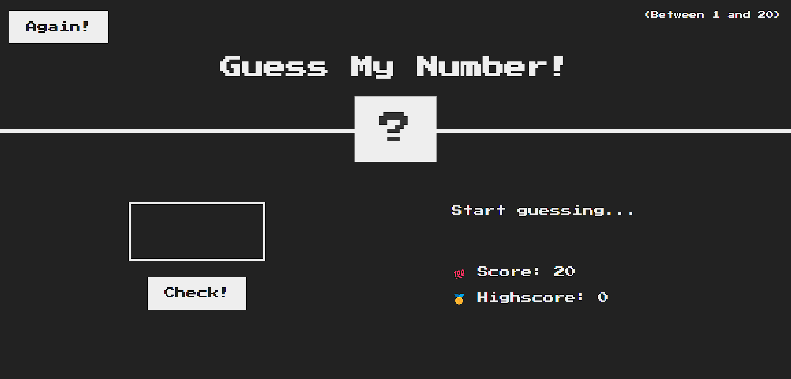
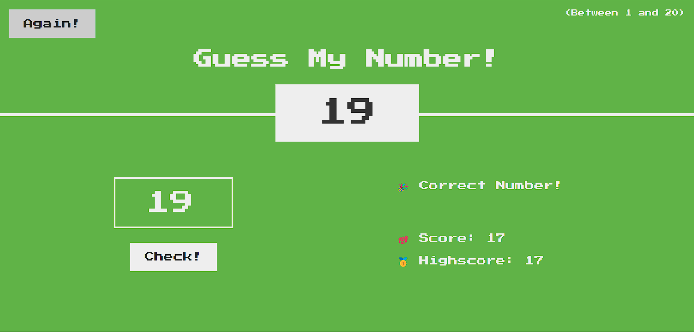

# Guess My Number Game 🎲

A fun and interactive number guessing game built using HTML, CSS, and JavaScript. The player tries to guess a randomly generated number between 1 and 20 while keeping track of their score and high score.

## 🚀 Features
- Randomly generated number between 1 and 20
- Feedback on incorrect guesses (too high/too low)
- Score tracking system
- High score retention
- Dynamic UI updates (color changes, animations)

## 🖥️ Technologies Used
- HTML
- CSS
- JavaScript (ES6)

## 🎮 How to Play
1. Enter a number between 1 and 20 in the input box.
2. Click the **Check!** button to submit your guess.
3. Get feedback on whether your guess is too high, too low, or correct.
4. If correct, the background turns green, and the high score updates if applicable.
5. Click the **Again!** button to restart the game.

## 📸 Screenshots
### Initial Screen


### Winning Screen


## 🛠️ Installation
1. Clone the repository:
   ```sh
   git clone https://github.com/Muqaddaspreet/Guess-My-Number.git
   ```
2. Navigate to the project folder:
   ```sh
   cd Guess-My-Number
   ```
3. Open `index.html` in your browser to start playing.

## 📬 Contact
For any queries or contributions, feel free to reach out via
- 👨‍💻 **Muqaddaspreet Singh Bhatia**
- 📫 Email: *(muqaddaspreetsb@gmail.com)*
- 🌐 GitHub: [Muqaddaspreet](https://github.com/Muqaddaspreet)
